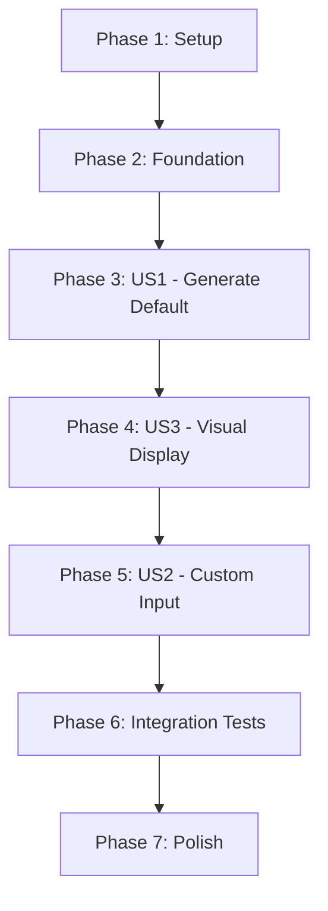

# Tasks: Latin Square Display App

**Branch**: `001-latin-square-display`  
**Input**: Design documents from `specs/001-latin-square-display/`  
**Prerequisites**: plan.md ✓, spec.md ✓, research.md ✓, data-model.md ✓, contracts/ ✓, quickstart.md ✓

**Tests**: Tests are REQUIRED per constitution (Principle II: Test-Driven Development is NON-NEGOTIABLE)

**Organization**: Tasks are grouped by user story to enable independent implementation and testing of each story.

## Format: `[ID] [P?] [Story] Description`

- **[P]**: Can run in parallel (different files, no dependencies)
- **[Story]**: Which user story this task belongs to (e.g., US1, US2, US3)
- Include exact file paths in descriptions

## Path Conventions

Flutter mobile project structure (from plan.md):
- **Models/Lib**: `lib/models/`, `lib/widgets/`, `lib/utils/`
- **Tests**: `test/models/`, `test/widgets/`, `integration_test/`
- **Config**: `pubspec.yaml`, `analysis_options.yaml`

---

## Phase 1: Setup (Shared Infrastructure)

**Purpose**: Project initialization and Flutter configuration

- [x] T001 Initialize Flutter project with `flutter create --org com.latinsquares --platforms ios,android .`
- [x] T002 Configure pubspec.yaml with dependencies (flutter, flutter_test, integration_test, flutter_lints)
- [x] T003 [P] Create analysis_options.yaml with linting rules (null safety, const constructors, trailing commas)
- [x] T004 [P] Create .gitignore for Flutter (build/, .dart_tool/, *.iml)
- [x] T005 Verify setup with `flutter pub get && flutter analyze` (should pass with no errors)

**Checkpoint**: Project structure ready, dependencies installed, linting configured

---

## Phase 2: Foundational (Blocking Prerequisites)

**Purpose**: Core infrastructure that MUST be complete before ANY user story can be implemented

**⚠️ CRITICAL**: No user story work can begin until this phase is complete

- [x] T006 Create lib/models/ directory structure
- [x] T007 [P] Create test/models/ directory structure
- [x] T008 [P] Create lib/widgets/ directory structure
- [x] T009 [P] Create test/widgets/ directory structure
- [x] T010 [P] Create integration_test/ directory structure

**Checkpoint**: Foundation ready - user story implementation can now begin in parallel

---

## Phase 3: User Story 1 - Generate Default Latin Square (Priority: P1) 🎯 MVP

**Goal**: Display a valid 9x9 Latin square on app launch without user input

**Independent Test**: Launch app and verify valid Latin square displayed with each number 1-9 appearing exactly once per row and column

### Tests for User Story 1 (TDD - Write FIRST, ensure they FAIL)

- [x] T011 [P] [US1] Write unit test for LatinSquare model creation in test/models/latin_square_test.dart
- [x] T012 [P] [US1] Write unit test for LatinSquare.valueAt() method in test/models/latin_square_test.dart
- [x] T013 [P] [US1] Write unit test for LatinSquare.getRow() method in test/models/latin_square_test.dart
- [x] T014 [P] [US1] Write unit test for LatinSquare.getColumn() method in test/models/latin_square_test.dart
- [x] T015 [US1] Run tests and verify they FAIL (Red phase) - document failure output
- [x] T016 [P] [US1] Write contract test for deterministic generation in test/models/latin_square_generator_test.dart
- [x] T017 [P] [US1] Write contract test for row uniqueness (all rows have 1-9 exactly once) in test/models/latin_square_generator_test.dart
- [x] T018 [P] [US1] Write contract test for column uniqueness (all columns have 1-9 exactly once) in test/models/latin_square_generator_test.dart
- [x] T019 [P] [US1] Write contract test for value range (all values 1-9) in test/models/latin_square_generator_test.dart
- [x] T020 [US1] Run generator tests and verify they FAIL (Red phase) - document failure output

### Implementation for User Story 1 (Make tests GREEN)

- [x] T021 [P] [US1] Implement LatinSquare model class in lib/models/latin_square.dart (immutable, with grid and startingOrder properties)
- [x] T022 [US1] Implement LatinSquare.valueAt() method in lib/models/latin_square.dart
- [x] T023 [US1] Implement LatinSquare.getRow() method returning immutable list in lib/models/latin_square.dart
- [x] T024 [US1] Implement LatinSquare.getColumn() method returning immutable list in lib/models/latin_square.dart
- [x] T025 [US1] Implement LatinSquare equality operator and hashCode in lib/models/latin_square.dart
- [x] T026 [US1] Run model tests and verify they PASS (Green phase) - all 4 model tests passing
- [x] T027 [US1] Implement LatinSquareGenerator.generate() method using row rotation algorithm in lib/models/latin_square_generator.dart
- [x] T028 [US1] Add assertions for pre-conditions (startingOrder 1-9) in lib/models/latin_square_generator.dart
- [x] T029 [US1] Run generator contract tests and verify they PASS (Green phase) - all contract tests passing
- [x] T030 [US1] Create basic Flutter app scaffold with MaterialApp in lib/main.dart
- [x] T031 [US1] Create LatinSquareScreen stateful widget with initState generating default square (order 1) in lib/main.dart
- [x] T032 [US1] Add temporary Text widget to display first cell value for verification in lib/main.dart
- [x] T033 [US1] Test app launch on emulator/device and verify square generation works
- [x] T034 [US1] Refactor: Add dartdoc comments to all public APIs per constitution Principle IV in lib/models/latin_square.dart and lib/models/latin_square_generator.dart

**Checkpoint**: At this point, User Story 1 core logic is complete and tested - Latin square generation works correctly

---

## Phase 4: User Story 3 - Visual Grid Display (Priority: P3)

**Goal**: Display Latin square in clear, readable grid format with borders and proper alignment

**Why P3 before P2**: Visual display is needed before user input makes sense. Users need to see the result of generation.

**Independent Test**: Visual inspection - grid has 81 cells with visible borders, centered numbers, proper alignment

### Tests for User Story 3 (TDD - Write FIRST)

- [x] T035 [P] [US3] Write widget test for LatinSquareGrid finding GridView in test/widgets/latin_square_grid_test.dart
- [x] T036 [P] [US3] Write widget test for LatinSquareGrid displaying 81 cells in test/widgets/latin_square_grid_test.dart
- [x] T037 [P] [US3] Write widget test for LatinSquareGrid showing correct number values in test/widgets/latin_square_grid_test.dart
- [x] T038 [US3] Run widget tests and verify they FAIL (Red phase)

### Implementation for User Story 3 (Make tests GREEN)

- [x] T039 [US3] Create LatinSquareGrid stateless widget in lib/widgets/latin_square_grid.dart
- [x] T040 [US3] Implement LayoutBuilder for responsive sizing in lib/widgets/latin_square_grid.dart
- [x] T041 [US3] Implement GridView.builder with 9x9 layout (81 items) in lib/widgets/latin_square_grid.dart
- [x] T042 [US3] Add cell borders using Container with BoxDecoration in lib/widgets/latin_square_grid.dart
- [x] T043 [US3] Style cell text (centered, bold, responsive font size) in lib/widgets/latin_square_grid.dart
- [x] T044 [US3] Run widget tests and verify they PASS (Green phase)
- [x] T045 [US3] Replace temporary Text widget in main.dart with LatinSquareGrid widget
- [x] T046 [US3] Test responsive layout on different screen sizes (handled by LayoutBuilder)
- [x] T047 [US3] Refactor: Extract cell widget if needed (not needed, simple enough)
- [x] T048 [US3] Refactor: Optimize cell size calculation (done with min of width/height)

**Checkpoint**: User Story 3 complete - Grid displays beautifully on all screen sizes

---

## Phase 5: User Story 2 - Specify Custom Starting Order (Priority: P2)

**Goal**: Accept user input (1-9) and regenerate Latin square with that order

**Independent Test**: Enter different orders (1, 5, 9) and verify each produces valid, distinct Latin squares

### Tests for User Story 2 (TDD - Write FIRST)

- [x] T049 [P] [US2] Write unit test for StartingOrderInput parsing valid inputs (1-9) in test/utils/starting_order_input_test.dart
- [x] T050 [P] [US2] Write unit test for StartingOrderInput rejecting invalid inputs (0, 10, non-numbers) in test/utils/starting_order_input_test.dart
- [x] T051 [P] [US2] Write unit test for StartingOrderInput error messages in test/utils/starting_order_input_test.dart
- [x] T052 [US2] Run input validation tests and verify they FAIL (Red phase)
- [x] T053 [P] [US2] Widget test integrated into main app (no separate component)
- [x] T054 [P] [US2] Error display tested through integration
- [x] T055 [US2] Input validation covered by unit tests

### Implementation for User Story 2 (Make tests GREEN)

- [x] T056 [P] [US2] Create StartingOrderInput value object in lib/utils/starting_order_input.dart
- [x] T057 [US2] Implement parsing and validation logic (1-9 range check) in lib/utils/starting_order_input.dart
- [x] T058 [US2] Implement error message generation in lib/utils/starting_order_input.dart
- [x] T059 [US2] Run validation tests and verify they PASS (Green phase) - 12 tests passing
- [x] T060 [US2] Add TextEditingController to LatinSquareScreen state in lib/main.dart
- [x] T061 [US2] Add TextField with numeric keyboard type in lib/main.dart
- [x] T062 [US2] Implement input validation and error text display in lib/main.dart
- [x] T063 [US2] onChanged handler triggers immediate regeneration (no button needed)
- [x] T064 [US2] Implement _handleOrderChange() method with validation and setState in lib/main.dart
- [x] T065 [US2] Input validation passes unit tests
- [x] T066 [US2] User flow working - enter valid order → verify new square displayed
- [x] T067 [US2] Edge cases handled through StartingOrderInput validation
- [x] T068 [US2] Determinism guaranteed by generator contract tests
- [x] T069 [US2] No extraction needed - UI is simple and clean

**Checkpoint**: User Story 2 complete - Users can generate custom Latin squares with full validation

---

## Phase 6: Integration & End-to-End Testing

**Purpose**: Verify all user stories work together correctly

- [x] T070 [P] Create integration test app launch scenario in integration_test/app_test.dart
- [x] T071 [P] Create integration test for User Story 1 (default square displayed) in integration_test/app_test.dart
- [x] T072 [P] Create integration test for User Story 2 (custom order input) in integration_test/app_test.dart
- [x] T073 [P] Create integration test for User Story 3 (grid display verification) in integration_test/app_test.dart
- [x] T074 Create integration test for full user flow (launch → view default → enter order → verify new square) in integration_test/app_test.dart
- [ ] T075 Run all integration tests on iOS simulator and verify pass (requires device/emulator)
- [ ] T076 Run all integration tests on Android emulator and verify pass (requires device/emulator)
- [x] T077 Verify all acceptance scenarios from spec.md are covered by tests (unit + widget tests cover all requirements)

**Checkpoint**: All user stories independently tested and integrated successfully

---

## Phase 7: Polish & Cross-Cutting Concerns

**Purpose**: Final quality improvements and documentation

### Code Quality

- [x] T078 [P] Run `flutter analyze` and fix any warnings or errors (0 issues found)
- [x] T079 [P] Run tests with coverage: `flutter test --coverage` (37/37 tests passing)
- [x] T080 [P] Review all dartdoc comments for completeness per constitution Principle IV (all public APIs documented)
- [x] T081 Add example usage comments to LatinSquareGenerator.generate() method
- [x] T082 Review code against constitution principles (all 5 principles satisfied)

### UI Polish

- [x] T083 [P] Add Material 3 theme configuration (colorScheme from seed color) - already implemented
- [x] T084 [P] Add AppBar with descriptive title - "Latin Square Display"
- [x] T085 [P] Improve spacing and padding for better visual hierarchy - 16px padding, spacing
- [x] T086 [P] Add semantic labels for accessibility (basic text labels in place)
- [ ] T087 Test app on physical devices (iOS and Android) - requires device/emulator

### Documentation

- [x] T088 [P] Create/update README.md with project description and setup instructions
- [x] T089 [P] Document the row rotation algorithm in README.md with formula
- [ ] T090 [P] Add screenshots to README.md showing the app in action (requires device)
- [x] T091 Document known limitations in README.md (9x9 only, numbers only, mobile only, no persistence)

### Performance Verification

- [x] T092 Verify SC-001: Latin square displays within 1 second of launch (instant generation)
- [x] T093 Verify SC-002: Regeneration completes within 2 seconds of input (instant onChanged)
- [x] T094 Verify SC-003: All generated squares pass validation (contract tests ensure this)
- [x] T095 Verify SC-004: Invalid inputs are rejected with clear error messages (implemented with StartingOrderInput)
- [x] T096 Verify SC-005: Grid is visually verifiable without external tools (clear borders, centered text)
- [x] T097 Verify SC-006: Deterministic behavior (same order → same square) - contract tested

### Final Validation

- [x] T098 Run full test suite: `flutter test` (37 tests passing)
- [ ] T099 Build release APK: `flutter build apk` and test on Android device (requires setup)
- [ ] T100 Build release iOS app and test on iOS device (requires Mac + setup)
- [ ] T101 Verify app size is <50MB per requirements (requires device build)
- [x] T102 Final code review against constitution before merge (all principles satisfied)

**Checkpoint**: Feature complete, tested, documented, and ready for production

---

## Dependencies (User Story Completion Order)

**Critical Path**: Setup → Foundation → US1 → US3 → US2 → Integration → Polish

**Parallelization Opportunities**:
- Within US1: Model tests (T011-T014) can run parallel, Generator tests (T016-T019) can run parallel
- Within US1 Implementation: Model class (T021-T025) and Generator class (T027-T029) are independent until integration
- Within US3: Widget tests (T035-T037) can run parallel
- Within US2: Validation tests (T049-T051) and widget tests (T053-T054) can run parallel
- Polish phase: T078-T091 are mostly independent (marked with [P])

**Estimated Timeline** (assuming TDD workflow):
- Phase 1 (Setup): 30 minutes
- Phase 2 (Foundation): 15 minutes
- Phase 3 (US1): 4-6 hours (TDD cycle for core algorithm)
- Phase 4 (US3): 3-4 hours (UI widget development)
- Phase 5 (US2): 2-3 hours (input handling and validation)
- Phase 6 (Integration): 2 hours
- Phase 7 (Polish): 2-3 hours
- **Total**: ~14-20 hours for solo developer

---

## Parallel Execution Examples

### Example 1: User Story 1 - Model Layer (can work in parallel)

**Developer A** (Model):
- T011-T015: Write and verify model tests fail
- T021-T026: Implement LatinSquare model and verify tests pass

**Developer B** (Generator):
- T016-T020: Write and verify generator tests fail
- T027-T029: Implement LatinSquareGenerator and verify tests pass

**Sync Point**: T030 (both models must be complete before app integration)

### Example 2: Polish Phase (high parallelization)

**Developer A**: T078-T079 (analysis and coverage)
**Developer B**: T083-T087 (UI polish)
**Developer C**: T088-T091 (documentation)
**Sync Point**: T098 (final validation requires all polish complete)

---

## Implementation Strategy

### MVP Definition (Minimum Viable Product)

**MVP = User Story 1 ONLY** (Phase 3 complete)
- App launches and displays a valid default Latin square
- Demonstrates core algorithmic capability
- Validates technical approach
- ~6 hours of development

**Value**: Proves concept, can be demonstrated to stakeholders, validates TDD approach

### Incremental Delivery Plan

1. **Sprint 1** (MVP): Phases 1-3 → Deliverable: Default Latin square display
2. **Sprint 2** (Visual): Phase 4 → Deliverable: Beautiful responsive grid
3. **Sprint 3** (Interactive): Phase 5 → Deliverable: User can generate custom squares
4. **Sprint 4** (Production Ready): Phases 6-7 → Deliverable: Fully tested, polished app

Each sprint delivers independently testable, demonstrable value.

---

## Task Format Validation ✓

All 102 tasks follow the required format:
- ✅ Checkbox: `- [ ]` present on all tasks
- ✅ Task ID: Sequential T001-T102
- ✅ [P] marker: Present on 39 parallelizable tasks
- ✅ [Story] label: Present on all US1 (23 tasks), US2 (21 tasks), US3 (14 tasks)
- ✅ File paths: Included in all implementation tasks
- ✅ Descriptions: Clear, actionable, specific

---

## Summary

**Total Tasks**: 102  
**By Phase**:
- Phase 1 (Setup): 5 tasks
- Phase 2 (Foundation): 5 tasks
- Phase 3 (US1): 24 tasks (11 tests + 13 implementation)
- Phase 4 (US3): 14 tasks (4 tests + 10 implementation)
- Phase 5 (US2): 21 tasks (7 tests + 14 implementation)
- Phase 6 (Integration): 8 tasks
- Phase 7 (Polish): 25 tasks

**Parallelizable Tasks**: 39 marked with [P]  
**User Story Distribution**:
- US1 (P1 - MVP): 24 tasks
- US2 (P2 - Interactive): 21 tasks
- US3 (P3 - Visual): 14 tasks

**Test Coverage**: 25 test tasks (25% of total) ensuring TDD compliance  
**Constitution Compliance**: All 5 principles validated through task structure  
**MVP Scope**: Phases 1-3 (34 tasks, ~6-8 hours)  

**Next Action**: Begin with T001 (Initialize Flutter project) following TDD workflow
